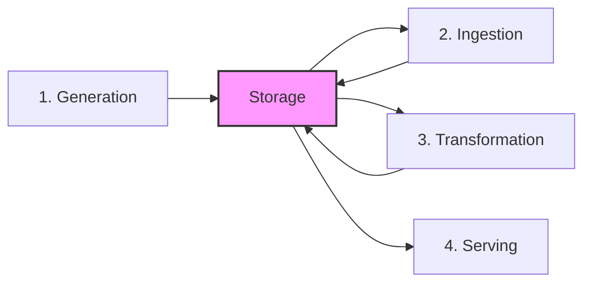

# Fundamentals of Data Engineering Concept Map

This document synthesizes the foundational concepts and engineering principles outlined in the *Fundamentals of Data Engineering* literature. It serves as a vocabulary and architectural baseline for `DES-SKILL` development.

---

## 1. The Data Engineering Lifecycle

The lifecycle represents the stages data goes through from its raw generation in source systems to its final consumption. 

*Note: Storage is placed in the center because it runs horizontally across all phases of the lifecycle.*

### A. Generation (Source Systems)
*   **Definition**: The origin of data (OLTP databases, APIs, IoT sensors, third-party logs, application events).
*   **Key Concept**: Data engineers must understand the behavioral patterns of source databases (CRUD vs. Insert-only) and the definitions of time (event time, database log time, and ingestion time).
*   **Engineering Challenge**: Maintaining schema contracts and communication with source system developers who own data generation.

### B. Storage
*   **Definition**: The systems holding data across the lifecycle (Object storage, block storage, databases, file systems).
*   **Key Concept**: Separating compute from storage to reduce costs and allow scaling. Consistency models (eventual consistency vs. strong consistency) impact read safety.
*   **Engineering Challenge**: Indexing, partitioning, and clustering strategies tailored to specific access patterns.

### C. Ingestion
*   **Definition**: Pulling or pushing data from source systems to storage systems.
*   **Key Concept**: Ingestion frequency (batch, micro-batch, real-time/streaming), transport patterns (push vs. pull vs. poll), and ingestion types (Full Snapshot, Differential, log-based CDC).
*   **Engineering Challenge**: Resolving network failures, late-arriving data, stream ordering, and payload serialization/deserialization.

### D. Transformation
*   **Definition**: Converting data from its raw form into a structured, standardized, and clean format for downstream users.
*   **Key Concept**: Transforming raw values (standardizing naming conventions, datatypes, timezones), handling nulls, and deduplicating.
*   **Engineering Challenge**: Selecting appropriate modeling patterns (Dimensional Kimball, Inmon normalization, or One Big Table).

### E. Serving
*   **Definition**: Making data available to end users (business analysts, ML engineers, external apps).
*   **Key Concept**: Serving interfaces (SQL queries, File exchange, REST APIs, Semantic metrics layers, Reverse ETL).
*   **Engineering Challenge**: Maintaining performance SLAs, caching, and building high-trust data products.

---

## 2. The Six Undercurrents

Undercurrents are critical engineering disciplines that must run horizontally across all stages of the lifecycle.

1.  **Security**: Column-level encryption, role-based access control (RBAC), row-level security (RLS), and PII discovery/masking.
2.  **Data Management**: Data catalogs, metadata management, schema registries, and column-level data lineage.
3.  **DataOps**: Continuous integration, continuous delivery (CI/CD), automated testing, data quality checks, observability, and incident alerting.
4.  **Data Architecture**: Designing loosely coupled systems, planning for failure, scalability, and ensuring decision reversibility.
5.  **Orchestration**: Directing the workflow execution (DAGs, dependencies, retry policies, backoffs, and scheduling).
6.  **Software Engineering**: Designing clean, reusable code, using design patterns, managing dependencies, and optimizing performance.

---

## 3. Data Maturity Levels

Understanding an organization's data maturity determines the complexity of the data engineering solutions needed.

| Maturity Level | Characteristics | Role of Data Engineer | Anti-Pattern |
| :--- | :--- | :--- | :--- |
| **Level 1: Starting with Data** | Ad-hoc analytics, simple reporting, few data sources, monolithic database. | Builder of basic ingestion pipelines, setting up primary warehouse. | Over-engineering, adopting complex streaming before basic batch works. |
| **Level 2: Scaling with Data** | Multiple complex data sources, structured pipelines, automation, data quality issues. | Establishing formal ingestion patterns, orchestration (DAGs), security/roles. | Lack of data quality checks, silent failures, lack of documentation. |
| **Level 3: Leading with Data** | Real-time streams, data mesh, ML pipelines in production, high data trust. | Automating data contracts, cost optimization (FinOps), building developer platforms. | Tool-first architecture, neglecting metadata and cost audits. |

---

## 4. Key Architectural Trade-offs

### A. Ingestion Mode Trade-offs
*   **CDC (Change Data Capture)**: High fidelity, low source impact, but complex to implement and requires log maintenance.
*   **Incremental Batch**: Simple, low source overhead, but vulnerable to missing deletes and late-arriving data.
*   **Streaming**: Near-zero latency, but high operational complexity, cost, and difficult to backfill.

### B. Analytical Modeling Trade-offs
*   **Kimball (Dimensional)**: Optimized for BI reporting, query simplicity, but requires upfront schema design and complex ETL.
*   **Inmon (Normalized)**: High consistency, single version of truth, but slow queries, complex joins, and hard to query directly for BI.
*   **One Big Table (OBT)**: Extremely fast read queries, simple for BI tools, but highly redundant, high storage cost, and harder to keep consistent.
